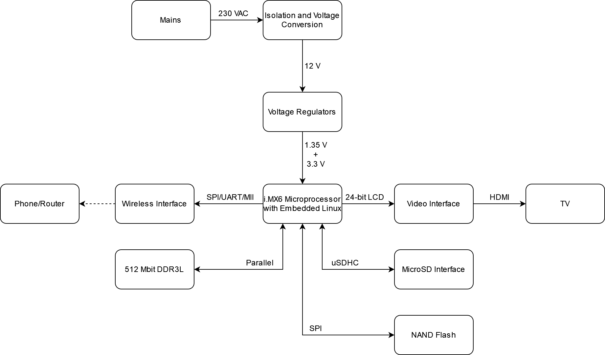

# SmartMirror
This project contains the KiCad and programming files used for a Smart Mirror project running Embedded Linux. The project is based on a microprocessor showing graphics and gathering data for showing information like weather and time.

## Project Structure
A block diagram of the project is shown in the figure below.

## Hardware
The hardware is based on the iMX6ULL microprocessor from NXP, with the design and PCB made myself, but inspired by evaluation kits.

## Software
The NXP Pins Tool is used for setting up the microprocessor. NXP's Embedded Linux tools are used for configuring the software.